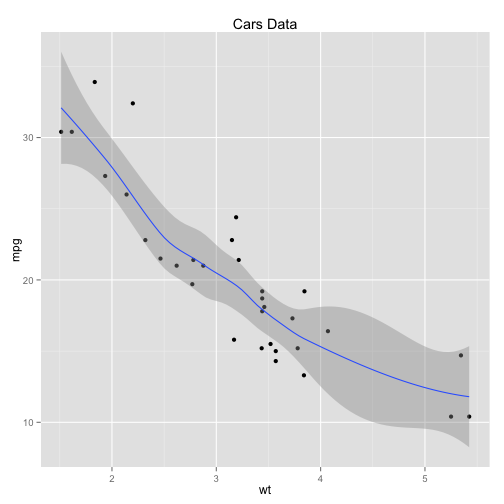

## Read-And-Delete

1. Edit YAML front matter
2. Write using R Markdown
3. Use an empty line followed by three dashes to separate slides!

--- .class #id 

## Slide 1

Animated List

> 1. Point 1
> 2. Point 2
> 3. Point 3

---

## Motion Chart

<!-- MotionChart generated in R 3.0.1 by googleVis 0.4.3 package -->
<!-- Fri Aug 16 16:58:00 2013 -->

<!-- jsHeader -->

 
<!-- jsChart -->  

 
<!-- divChart -->
  

---

## Slide 3

 

